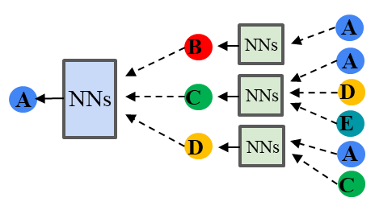

# GCN

$\def\bm{\boldsymbol}$**GCN**は最も基礎的で直観的に理解しやすいGraph Neural Networkです．非常に端的に言うと，自身の特徴量と枝で繋がってる節点の特徴量を平均化して重みを掛け，自身の特徴量とするだけです．

## GCNの理論

GCNは下記の式で表すことができます．

$\bm{H}^{(l+1)} = \sigma(\bm{D}'^{-\frac{1}{2}}\bm{S}'\bm{D}'^{-\frac{1}{2}}\bm{H}^{(l)}\bm{W}^{(l)}) $

ここで，$\bm{H}^{(0)}=\bm{X}$になります．


あるひとつの節点$v$の特徴量で考えると下記になります．

$\bm{H}_v^{(l+1)}=\sigma(\sum_{u \in \mathbb{N}_v\cup v}\frac{1}{\sqrt{d_vd_u}}\bm{H}_u \bm{W}^{(l)})$

GCNのイメージは周りからembeddingを集めてNNを通してembeddingを生成して，またそのembeddingを渡すということを繰り返します．オリジナルのGCNは2層から構成されていて，経験的にも2層が最適になることが多いです．



## GCNの実装
[code](https://colab.research.google.com/drive/1X0SsiXWR63XyXISOWYTRL5gSnGcGvcdE?usp=sharing)

GCNの実装では$\bm{D}'^{-\frac{1}{2}}\bm{S}'\bm{D}'^{-\frac{1}{2}}$の部分は学習に関係ないため事前に計算します．

学習時には，$\bm{D}'^{-\frac{1}{2}}\bm{S}'\bm{D}'^{-\frac{1}{2}}$，$\bm{H}^{(l)}$および，$\bm{W}^{(l)}$を行列積することがGCN layerの処理になります．

下記が実装例です．この実装では，バイアス項の有無を設定できるようにしています．

```
class GCNLayer(nn.Module):
    def __init__(self, in_features, out_features, use_bias=True):
        super(GCNLayer, self).__init__()
        self.weight = nn.Parameter(torch.FloatTensor(torch.zeros(size=(in_features, out_features))))
        if use_bias:
            self.bias = nn.Parameter(torch.FloatTensor(torch.zeros(size=(out_features,))))
        else:
            self.register_parameter('bias', None)

        self.initialize_weights()

    def initialize_weights(self):
        nn.init.xavier_uniform_(self.weight)
        if self.bias is not None:
            nn.init.zeros_(self.bias)

    def forward(self, x, adj):
        x = x @ self.weight
        if self.bias is not None:
            x += self.bias

        return torch.sparse.mm(adj, x)
```

下記は2層から成るGCNのモデルです．ノードの属性集合$x$と$adj$ (つまり，$\bm{D}'^{-\frac{1}{2}}\bm{A}'\bm{D}'^{-\frac{1}{2}}$)を受け取って，1層目のGCN層の畳込み，活性化関数Relu，dropout，2層目のGCN層の畳込みを行ったものを予測値として返します．

```
class GCN(nn.Module):
    def __init__(self, node_features, hidden_dim, num_classes, dropout, use_bias=True):
        super(GCN, self).__init__()
        self.gcn_1 = GCNLayer(node_features, hidden_dim, use_bias)
        self.gcn_2 = GCNLayer(hidden_dim, num_classes, use_bias)
        self.dropout = nn.Dropout(p=dropout)

    def initialize_weights(self):
        self.gcn_1.initialize_weights()
        self.gcn_2.initialize_weights()

    def forward(self, x, adj):
        x = F.relu(self.gcn_1(x, adj))
        x = self.dropout(x)
        x = self.gcn_2(x, adj)
        return x
```

## GCNのポイント

周囲の特徴量を集約して学習パラメータを掛けることで自身の特徴量とする．

## 文献

Thomas N. Kipf and Max Welling, "Semi-Supervised Classification with Graph Convolutional Networks",
ICLR 2017 https://arxiv.org/abs/1609.02907