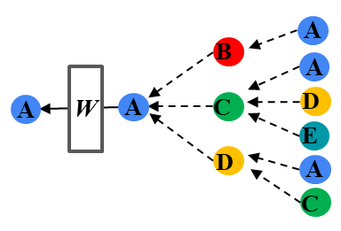

# SGC

$\def\bm{\boldsymbol}$**SGC**はGCNの処理を簡易にすることで学習の効率化を目指したGNNです．

## SGCの理論

GCNでは隣接する節点の集約という処理を逐一実行しなければいけませんでした．逐一処理しなければいけない原因は活性化関数の存在です．活性化関数があるせいで集約の事前計算ができませんでした．

SGCでは活性化関数を全て取り除き，事前に特徴量を集約し，線形層での学習を行うという処理を行います．

SGCは下記の数式で表すことができます．

$\bm{H}=(\bm{D}'^{-\frac{1}{2}}\bm{S}'\bm{D}'^{-\frac{1}{2}})^k\bm{X}\bm{W}$

$k$はGCNにおける畳込み回数に相当します．


非常に簡単な式ですが，学習も高速，精度もGCNとそれほど変わらないという結果が報告されています．

SGCのイメージはホップ数分畳込みした後のみに重みパラメータかけるということにつきます．これにより，学習時の畳込みが不要になり学習速度があがります．



## SGCの実装

$\bm{D}'^{-\frac{1}{2}}\bm{S}'\bm{D}'^{-\frac{1}{2}}$を$k$回掛けた後にMLPにわたすという処理になります．ここまでのGCNとGATの実装と下記を参考に実装してみましょう．

```
class MLP (nn.Module):
    def __init__(self, node_features, hidden_dim, num_classes, dropout):
        super(MLP, self).__init__()
        self.fc = nn.Linear(node_features, hidden_dim)   
        
    def forward(self, x):
        return self.fc(x)
```

## SGCの文献

Felix Wu, Tianyi Zhang, Amauri Holanda de Souza Jr., Christopher Fifty, Tao Yu, Kilian Q. Weinberger, "Simplifying Graph Convolutional Networks", ICML 2019 https://arxiv.org/abs/1902.07153